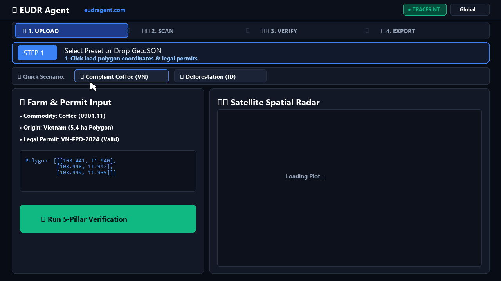

# 🌲 EUDRAgent.com | Autonomous EUDR Compliance & TRACES-NT DDS Platform

[](https://www.python.org/)
[](https://fastapi.tiangolo.com/)
[](https://postgis.net/)
[](https://eur-lex.europa.eu/eli/reg/2023/1115/oj)
[-brightgreen.svg)](https://github.com/nohosa001-pixel/eudr-compliance-agent)
[](https://polygonscan.com)
[](https://glama.ai/mcp/servers)
[](https://smithery.ai/servers/nohosa001/eudr-compliance-agent)
[](https://opensource.org/licenses/MIT)
[](https://cloud.google.com/run)

**EUDRAgent** is an enterprise-grade autonomous compliance automation and Due Diligence Statement (DDS) generation engine for the **European Union Deforestation Regulation (Regulation (EU) 2023/1115)**.

---

## 📽️ 4-Step Instant Demo (2s Audit)



### 💡 Why EUDR Agent? (Instant Problem Solver)

| ❌ The Problem | ➔ | ✅ The Solution |
| :--- | :---: | :--- |
| **4% Revenue Fines & Blocked Cargo** | ➔ | **0% Fine Guarantee & Verified Clearance** |
| **Weeks of Manual Satellite GIS Checks** | ➔ | **2-Second Multi-Satellite Radar Scan** |
| **Rejected TRACES-NT XML Customs Filings** | ➔ | **1-Click Validated Official TRACES-NT XML** |
| **Trading Counterparty Fraud & Bad Data** | ➔ | **Web3 AgentEscrow & EIP-712 Economic Slashing** |
| **Prompt Injections & Trade Data Hallucinations** | ➔ | **Security Gate x402 & NLI Yield Fact-Checking** |
| **Manual B2B Procurement Overhead** | ➔ | **Autonomous Reverse-Auction A2A Clearing** |

---

## 🧭 The 4-Step Flow: `1. UPLOAD ➔ 2. SCAN ➔ 3. VERIFY ➔ 4. EXPORT`

---

## 📌 Live Cloud Portals & Access Points

| Service Portal | URL / Route | Description |
| :--- | :--- | :--- |
| 🌟 **SaaS Official Landing Page** | [`/`](https://eudr-compliance-agent-7qxtp3324q-du.a.run.app/) | Interactive 4-country satellite radar sandbox & transparent pricing |
| 🖥️ **Enterprise Operator Console** | [`/dashboard`](https://eudr-compliance-agent-7qxtp3324q-du.a.run.app/dashboard) | 4ha polygon self-healing, multi-satellite analysis, & TRACES-NT DDS generation |
| 🌾 **Supplier Pre-Clearance Portal** | [`/supplier-portal`](https://eudr-compliance-agent-7qxtp3324q-du.a.run.app/supplier-portal) | Mobile-friendly self-assessment for overseas smallholders & cooperatives |
| 📖 **Interactive API Documentation** | [`/docs`](https://eudr-compliance-agent-7qxtp3324q-du.a.run.app/docs) | Swagger UI for ERP, SAP, and customs system integration |
| 🩺 **System Health Endpoint** | [`/api/v1/eudr/health`](https://eudr-compliance-agent-7qxtp3324q-du.a.run.app/api/v1/eudr/health) | EUDR cut-off baseline date & cluster health status |
| 📊 **Prometheus APM Telemetry** | [`/metrics`](https://eudragent.com/metrics) | Standard OpenMetrics 0.0.4 text export for 24/7 APM surveillance |
| 🛡️ **x402 Security Gate Inspector** | [`/api/v1/security/inspect`](https://eudragent.com/api/v1/security/inspect) | Sub-millisecond Prompt Injection & Agronomic Fact-Check |
| 🤝 **Autonomous A2A Marketplace** | [`/api/v1/marketplace/rfq/create`](https://eudragent.com/api/v1/marketplace/rfq/create) | Autonomous commodity procurement and bid auto-clearing |
| 🤖 **Model Context Protocol (MCP)** | [`/api/v1/mcp`](https://eudragent.com/api/v1/mcp) | JSON-RPC 2.0 MCP endpoint for Claude, Cursor & AI Agents |
| 📄 **LLM Discovery Spec** | [`/llms.txt`](https://eudragent.com/llms.txt) | LLM crawler & agent standard summary |

---

## 🤖 Model Context Protocol (MCP) Integration (Glama.ai Ready)

EUDRAgent includes a native **Model Context Protocol (MCP v2024-11-05)** server, allowing AI assistants like **Claude Desktop, Cursor, Antigravity, and Zed** to autonomously perform EUDR compliance audits.

### Install via Smithery CLI

To automatically install and configure for Claude Desktop:

```bash
npx -y @smithery/cli install nohosa001/eudr-compliance-agent --client claude
```

### Quick Setup for Claude Desktop (`claude_desktop_config.json`)

```json
{
  "mcpServers": {
    "eudr-compliance": {
      "command": "python",
      "args": [
        "/path/to/eudr-compliance-agent/mcp_server_stdio.py"
      ]
    }
  }
}
```

### Remote MCP Server Setup (HTTP Transport)

```json
{
  "mcpServers": {
    "eudr-compliance-cloud": {
      "url": "https://eudragent.com/api/v1/mcp"
    }
  }
}
```

### 30 Registered Autonomous Agent Tools

| Category | Tool Name | Purpose |
| :--- | :--- | :--- |
| **GIS & Verification** | `eudr_verify_plot` | Validates GIS coordinates, WGS84 bounds, and polygon 4.0ha threshold |
| **Deforestation Radar** | `eudr_check_deforestation` | Radar & optical satellite canopy loss analysis against 2020-12-31 baseline |
| **Satellite Mapping** | `eudr_render_satellite_map` | Generates Sentinel-2 NDVI canopy density SVG radar visualization |
| **Customs & Legality** | `eudr_verify_vies_vat` | Real-time EU Commission VIES VAT cross-border reverse charge check |
| **Compliance Filing** | `eudr_generate_dds` | Compiles official TRACES-NT XML Due Diligence Statement declaration |
| **Security & Merkle** | `eudr_verify_audit_integrity` | SHA-256 tamper-evident cryptographic chain audit verification |
| **Pricing Estimation** | `eudr_estimate_compliance_cost` | Automated budget estimation based on plot volume and resolution |
| **USDC Payment** | `eudr_create_payment_order` | On-chain USDC payment order with budget cap safety guardrails |
| **Tx Confirmation** | `eudr_confirm_payment` | Validates on-chain tx_hash and provisions live Pro API Key |
| **Micro Settlement** | `eudr_agent_micro_pay` | M2M on-demand plot micro-payment on Base/Polygon/Arbitrum |
| **Gasless Permit** | `eudr_agent_eip3009_pay` | Gasless USDC authorization without requiring ETH/MATIC gas |
| **Budget Telemetry** | `eudr_get_agent_budget_status` | Real-time agent budget and monthly plot balance inquiry |
| **Customs Clearance** | `eudr_generate_customs_certificate` | Generates official EU SWE-C Green Lane Customs Certificate |
| **TRACES Direct XML** | `eudr_export_traces_xml` | Direct XSD v2.4 compliant EU customs XML export |
| **Risk Benchmarking** | `eudr_benchmark_country` | Article 29 Country Benchmarking risk tier (Low, Standard, High) |
| **Supply Chain Chaining**| `eudr_link_downstream_chain` | Article 4(8) downstream pass-through DDS reference chaining |
| **Statutory Exemption**| `eudr_issue_statutory_exemption`| Evaluates Delegated Act Sept 2026 statutory exemption (Bovine leather) |
| **Parcel Slicing** | `eudr_slice_parcel` | Sub-divides oversized (>4ha) smallholder parcels into <4ha polygons |
| **Compact Summary** | `eudr_evaluate_compact` | Ultra-compact (~300 token) token-efficient summary for LLMs |
| **Instant Alerts** | `eudr_send_telegram_alert` | Instant real-time alerts to maintainer Telegram channel |
| **Agent Evolution** | `eudr_submit_agent_feedback` | Allows autonomous bots to submit evolution proposals |
| **Smart Escrow Create**| `eudr_create_agent_escrow` | Creates B2B trade Smart Escrow locking USDC in payment vaults |
| **Smart Escrow Fund** | `eudr_fund_agent_escrow` | Confirms on-chain USDC transfer and transitions to FUNDED_LOCKED |
| **Smart Escrow Release**| `eudr_release_agent_escrow`| Releases locked escrow upon verified EU customs clearance code |
| **Smart Escrow Arbitrate**| `eudr_arbitrate_agent_escrow`| Deterministic satellite arbitration (100% refund or release) |
| **Web3 Oracle Attest** | `eudr_issue_eip712_attestation`| **Issues EIP-712 Attestation as EUDR Oracle for AgentEscrow.sol** |
| **Web3 Oracle Verify** | `eudr_verify_eip712_attestation`| **Cryptographically verifies EIP-712 proof for completeJob/slashJob** |
| **x402 Security Shield**| `eudr_inspect_payload_security`| **Prompt injection defense, AST code barrier & agronomic yield fact-check** |
| **A2A RFQ Broadcast** | `eudr_publish_compliance_rfq`| **Buyer AI Agent broadcasts EUDR compliance RFQ to supplier network** |
| **A2A Bid Submit** | `eudr_submit_compliance_bid` | **Supplier AI Agent submits competitive geolocated compliance bid** |

---

## 🏛️ Core Architecture & The 4 EUDR Pillars

```text
EUDR Supply Chain Payload (JSON / CSV / GeoJSON / Shapefile)
                           │
                           ▼
┌─────────────────────────────────────────────────────────────────────────┐
│ 1. Geodesic Spatial & Topology Engine (SpatialValidator)                │
│    - Strict Article 9(1)(d) 4-Hectare Rule Enforcement                  │
│    - Sub-second WGS84 Geodesic Ellipsoidal Area Calculation (GRS80/WGS84)│
│    - Autonomous Polygon Self-Healing (Self-Intersection & Spike Repair) │
└────────────────────────────────────┬────────────────────────────────────┘
                                     │
                                     ▼
┌─────────────────────────────────────────────────────────────────────────┐
│ 2. Multi-Constellation Satellite Radar (DeforestationAnalyzer)          │
│    - Strict Cut-off Baseline: 31 December 2020                          │
│    - Copernicus Sentinel-2 (NDVI 10m Multi-Spectral Monitoring)         │
│    - Hansen Global Forest Change (GFC) Annual Loss Detection            │
│    - JRC Global Forest Cover & Canopy Density Triangulation             │
└────────────────────────────────────┬────────────────────────────────────┘
                                     │
                                     ▼
┌─────────────────────────────────────────────────────────────────────────┐
│ 3. Legal Document & Risk Benchmarking Auditor (LegalAuditor)            │
│    - EU Country Risk Benchmarking (Low / Standard / High Risk Tiers)    │
│    - Origin Legality Verification (Land Titles, Harvest Permits)        │
│    - Free, Prior, and Informed Consent (FPIC) for Indigenous Peoples    │
└────────────────────────────────────┬────────────────────────────────────┘
                                     │
                                     ▼
┌─────────────────────────────────────────────────────────────────────────┐
│ 4. Cryptographic TRACES-NT DDS Statement Generator (DDSGenerator)       │
│    - EU Customs Direct B2G Submission Payload Packaging                 │
│    - HMAC-SHA256 Cryptographic Digital Signature & Merkle Audit Trail   │
│    - Article 31 (5-Year Record Retention) Immutable Evidence Bundle    │
└─────────────────────────────────────────────────────────────────────────┘
```

---

## 🚀 Quick Start Guide (Local Development)

### 1. Installation

```bash
# Clone the repository
git clone https://github.com/nohosa001-pixel/eudr-compliance-agent.git
cd eudr-compliance-agent

# Create and activate virtual environment
python -m venv .venv
.\.venv\Scripts\activate      # Windows
source .venv/bin/activate       # Linux / macOS

# Install dependencies
pip install -r requirements.txt
```

### 2. Run Local Development Server

```bash
uvicorn app.main:app --reload --port 8000
```

Open your browser at `http://localhost:8000` to view the SaaS Landing Page or `http://localhost:8000/dashboard` for the Operator Console.

### 3. Run Test Suite

```bash
pytest -v tests/
```

Runs the full suite of **75 automated tests** (Spatial validation, satellite loss detection, legal auditing, PostGIS integration, and API security).

---

## 🔑 Programmatic API & ERP Integration

### 1. Generate SaaS API Key

```bash
curl -X POST "http://localhost:8000/api/v1/auth/api-keys" \
  -H "Content-Type: application/json" \
  -d '{
    "company_name": "Global Timber & Coffee Trading Ltd",
    "contact_email": "compliance@company.com",
    "tier": "PRO"
  }'
```

### 2. Submit Compliance Due Diligence Evaluation

```bash
curl -X POST "http://localhost:8000/api/v1/eudr/evaluate" \
  -H "Content-Type: application/json" \
  -H "X-API-Key: eudr_live_YOUR_KEY_HERE" \
  -d '{
    "operator_id": "VN-EXP-COFFEE-8821",
    "operator_name": "Highland Agri Export Ltd",
    "commodity": "COFFEE",
    "hs_code": "0901.11.00",
    "product_description": "Arabica Green Coffee Beans Premium Grade",
    "net_mass_kg": 24000.0,
    "plots": [
      {
        "plot_id": "VN-LAMDONG-001",
        "country_code": "VN",
        "geometry": {
          "type": "Polygon",
          "coordinates": [
            [
              [108.4380, 11.9400],
              [108.4420, 11.9400],
              [108.4420, 11.9435],
              [108.4380, 11.9435],
              [108.4380, 11.9400]
            ]
          ]
        },
        "declared_area_ha": 17.5,
        "production_date_start": "2023-10-01",
        "production_date_end": "2023-11-15",
        "producer_name": "Da Lat Arabica Cooperative"
      }
    ],
    "documents": [
      {
        "document_type": "LAND_TITLE",
        "document_id": "LURC-VN-2018-990",
        "country_code": "VN",
        "issuing_authority": "Lam Dong Department of Natural Resources",
        "issue_date": "2018-05-12",
        "expiry_date": "2038-05-12",
        "plot_ids": ["VN-LAMDONG-001"]
      }
    ]
  }'
```

---

## ☁️ Production Cloud Deployment

### 1. Deploy to Google Cloud Run (One-Click)

```powershell
.\deploy_gcp.ps1
```

Builds the container and deploys to **Google Cloud Run** in `asia-northeast3` (Seoul) with auto-scaling, HTTPS, and custom domain mapping.

### 2. Deploy via Docker Compose & Nginx SSL

```bash
# Copy and configure environment variables
cp .env.production.example .env.production
nano .env.production

# Execute deployment script
chmod +x deploy.sh
./deploy.sh
```

---

## 📋 Regulated Annex I Commodities

EUDRAgent provides automatic classification and compliance verification for all 7 Annex I commodity categories:

- ☕ **Coffee** (HS Chapter 0901)
- 🍫 **Cocoa** (HS Chapter 1801–1806)
- 🌴 **Oil Palm** (HS Chapter 1511, 1207, 2306, 2905, 3823)
- 🪵 **Wood & Timber** (HS Chapter 4401–4421, 4701–4707, 4801–4823, 9401, 9403)
- 🌱 **Soya** (HS Chapter 1201, 1208, 1507, 2304)
- 🚲 **Rubber** (HS Chapter 4001, 4005, 4006, 4007, 4008, 4011, 4012)
- 🥩 **Cattle / Beef & Leather** (HS Chapter 0102, 0201, 0202, 4101, 4104, 4107)

---

## ⚖️ Legal & Regulatory Disclaimer

This software is designed to assist operators and traders in complying with their obligations under Regulation (EU) 2023/1115. Operators remain legally responsible for the final submission of Due Diligence Statements to EU competent authorities via TRACES-NT.

---

## 📄 License

Released under the **MIT License**. Copyright &copy; 2026 EUDRAgent.com. All rights reserved.
