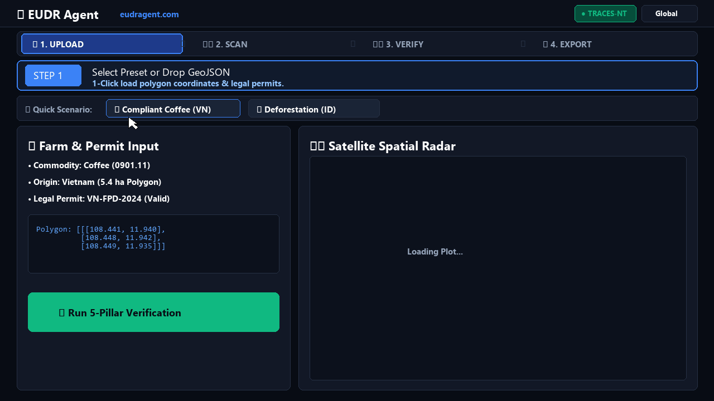

# 🌲 EUDRAgent.com | Autonomous EUDR Compliance & Multi-Chain Escrow Platform

[](https://github.com/nohosa001-pixel/eudr-compliance-agent/actions)
[](https://www.python.org/)
[](https://fastapi.tiangolo.com/)
[](https://postgis.net/)
[](https://eur-lex.europa.eu/eli/reg/2023/1115/oj)
[-brightgreen.svg)](https://github.com/nohosa001-pixel/eudr-compliance-agent)
[](https://polygonscan.com)
[](https://solscan.io)
[](https://glama.ai/mcp/servers/nohosa001-pixel/eudr-compliance-agent)
[](https://cloud.google.com/run)
[](https://opensource.org/licenses/MIT)

**EUDRAgent** is an enterprise-grade autonomous compliance automation and Due Diligence Statement (DDS) generation engine for the **European Union Deforestation Regulation (Regulation (EU) 2023/1115)**.

Equipped with high-resolution satellite radar (Copernicus Sentinel-1/2 SAR & Optical), 4ha polygon self-healing, EU TRACES-NT XML customs clearance, autonomous Reverse-Auction B2B procurement, sub-5ms cognitive firewall via **`security-gate-x402`**, and multi-chain smart escrows across **Solana Mainnet-Beta (SPL-USDC), Polygon PoS, Base, and Arbitrum One**.

---

## 📽️ 4-Step Instant Demo (2-Second Automated Audit)



### 💡 Why EUDRAgent? (The Enterprise Solution)

| ❌ The Legacy Problem | ➔ | ✅ The EUDRAgent Solution |
| :--- | :---: | :--- |
| **4% Global Revenue Fines & Seized Cargo** | ➔ | **0% Fine Guarantee & Verified Customs Clearance** |
| **Weeks of Manual GIS Parcel Inspection** | ➔ | **2-Second Multi-Satellite Radar & Optical Scan** |
| **Topological Polygon Defects & Coordinate Reversals** | ➔ | **Autonomous Self-Healing GIS (Bowties, WGS84, 4ha Rule)** |
| **Rejected TRACES-NT XML Customs Filings** | ➔ | **1-Click Official Validated TRACES-NT XML & JSON-LD** |
| **Trading Counterparty Fraud & Data Tampering** | ➔ | **Anchor Solana Escrow + EIP-712 Oracle Slashing** |
| **Smallholder Payment Delays & High Gas Fees** | ➔ | **Sub-Second Direct Split via Solana SPL-USDC & Solana Pay** |
| **Prompt Injections & Supply Chain Hallucinations** | ➔ | **Sub-5ms Cognitive Firewall via `security-gate-x402`** |
| **Manual Procurement Inefficiencies** | ➔ | **Autonomous A2A Reverse-Auction Marketplace** |

---

## 🌐 Autonomous 4-Node Inter-Agent Mesh Ecosystem

EUDRAgent is natively integrated into the **@nohosa001-pixel Autonomous Agent Mesh**, operating over the Model Context Protocol (MCP) JSON-RPC 2.0 with cryptographic verification:

```text
               ┌────────────────────────────────────────────────────────┐
               │         EUDR Compliance Agent (Port 8000)              │
               │   • Copernicus Sentinel-1/2 SAR / Optical Telemetry   │
               │   • WGS84 Geodesic Polygon Self-Healing (<4ha Rule)   │
               │   • Official TRACES-NT B2G Customs XML Compiler       │
               └─────────┬──────────────────────┬───────────────────────┘
                         │                      │
       MCP / JSON-RPC    │                      │  MCP / JSON-RPC
       Cognitive Shield  │                      │  Clean Supplier Web
                         ▼                      ▼
┌──────────────────────────────────────┐  ┌─────────────────────────────────────┐
│    Node 2: security-gate-x402        │  │     Node 3: x402-cleanweb-agent     │
│ • Sub-5ms Cognitive Firewall         │  │ • Autonomous Web Scraping           │
│ • EIP-712 Domain 3 Truth Oracle      │  │ • HTML Bloat & Ad Stripping         │
│ • Universal Direct Split Escrow      │  │ • Smallholder Cooperative Dossiers  │
│ • Solana Ed25519 Mainnet Attestor    │  │ • Production Web Intelligence       │
└──────────────────────────────────────┘  └─────────────────────────────────────┘
                         │
                         │ Cross-Check ESG
                         ▼
┌───────────────────────────────────────────────────────────────────────────────┐
│                        Node 4: minerals-oracle-x402                           │
│  • Critical Minerals Valuation (Li, Ni, Cu, Co, Ti)                           │
│  • EUDR Forest Conflict ESG Cross-Check & Traceability Audits                 │
└───────────────────────────────────────────────────────────────────────────────┘
```

---

## ⚡ Multi-Chain Escrow & Settlement Rails

EUDRAgent supports dual-layer smart contracts for frictionless B2B trade execution, eliminating commercial default risk while ensuring zero-deforestation compliance:

### 1. Solana Mainnet-Beta SPL-USDC Escrow Rail (High Throughput)
* **Settlement Token**: Native SPL-USDC (`EPjFWdd5AufqSSqeM2qN1xzybapC8G4wEGGkZwyTDt1v`, 6 decimals).
* **Speed & Cost**: 400ms finality, ~$0.00025 network fee.
* **Anchor Smart Contract**: [`programs/eudr-escrow/src/lib.rs`](programs/eudr-escrow/src/lib.rs) with `initialize_escrow`, `settle_direct_split`, and `slash_non_compliant`.
* **Oracle Attestation**: Ed25519 cryptographic truth proof (`EUDR_FOREST_SOLANA` domain).
* **Solana Pay**: Dynamic QR payloads & deep links (`solana:<recipient>?amount=...&spl-token=...`).
* **Treasury Account**: `411ksMz9RHYVtVMe6RUUErzZYtrU9zzvkgzswKbqx9qp`.

### 2. Multi-Chain EVM Payment Vaults (Polygon, Base, Arbitrum)
* **Polygon PoS (137)**: `0x45ecBfAa2F4B0Bc6ccD3eB2dB9B1Ca49CF121861` (Native USDC: `0x3c49...3359`).
* **Base Mainnet (8453)**: `0x28292D76E07E5539F15F3b97935dE8E0432E76DD` (Native USDC: `0x8335...2913`).
* **Arbitrum One (42161)**: `0x28292D76E07E5539F15F3b97935dE8E0432E76DD` (Native USDC: `0xaf88...5831`).
* **Smart Contract**: `AgentEscrow.sol` with EIP-712 off-chain oracle verification (`0x90F8...C9C1`).

---

## 📌 Live Cloud Portals & Diagnostic Endpoints

| Portal / API Route | Target URL | Description |
| :--- | :--- | :--- |
| 🌟 **SaaS Official Landing Page** | [`/`](https://eudragent.com/) | Interactive 4-country satellite radar sandbox & transparent pricing |
| 🖥️ **Operator Console** | [`/dashboard`](https://eudragent.com/dashboard) | 4ha polygon self-healing, multi-satellite analysis, & TRACES-NT DDS generation |
| 🌾 **Supplier Pre-Clearance Portal** | [`/supplier-portal`](https://eudragent.com/supplier-portal) | Mobile-friendly self-assessment for overseas smallholders & cooperatives |
| 📖 **Interactive API Documentation** | [`/docs`](https://eudr-compliance-agent-212942243360.asia-northeast3.run.app/docs) | OpenAPI 3.1 / Swagger UI for ERP, SAP, and customs system integration |
| 🛡️ **Security Gate Diagnostics** | [`/api/v1/eudr/mesh/security-gate/diagnostics`](https://eudr-compliance-agent-212942243360.asia-northeast3.run.app/api/v1/eudr/mesh/security-gate/diagnostics) | **Live 4-tier probe of connected `security-gate-x402` (Seoul Cloud Run)** |
| ⛓️ **Multi-Chain RPC Status** | [`/api/v1/payment/chains/status`](https://eudr-compliance-agent-212942243360.asia-northeast3.run.app/api/v1/payment/chains/status) | **Real-time RPC block heights & USDC contracts for Polygon, Base, Arbitrum** |
| ☀️ **Solana Escrow Cluster** | [`/api/v1/escrow/solana/cluster-status`](https://eudr-compliance-agent-212942243360.asia-northeast3.run.app/api/v1/escrow/solana/cluster-status) | Live slot height, 400ms block time, and SPL-USDC mint status on Solana |
| 🤝 **A2A Marketplace RFQ** | [`/api/v1/marketplace/rfq/create`](https://eudr-compliance-agent-212942243360.asia-northeast3.run.app/api/v1/marketplace/rfq/create) | Autonomous commodity procurement and reverse-auction clearing |
| 🤖 **Model Context Protocol (MCP)** | [`/api/v1/mcp`](https://eudr-compliance-agent-212942243360.asia-northeast3.run.app/api/v1/mcp) | JSON-RPC 2.0 MCP endpoint for Claude Desktop, Cursor, Antigravity |
| 📄 **LLM Discovery Directory** | [`/llms.txt`](https://eudragent.com/llms.txt) | LLM crawler & agent standard summary |


---

## 🤖 Model Context Protocol (MCP) Integration

EUDRAgent provides a native **MCP v2024-11-05** server exposing **32+ autonomous agent tools**. Compatible with **Claude Desktop, Cursor, Antigravity, and Zed**.

### Claude Desktop Setup (`claude_desktop_config.json`)

```json
{
  "mcpServers": {
    "eudr-compliance": {
      "command": "python",
      "args": [
        "C:\\Users\\nohos\\OneDrive\\바탕 화면\\eudr-compliance-agent\\mcp_server_stdio.py"
      ]
    },
    "eudr-compliance-cloud": {
      "url": "https://eudr-compliance-agent-7qxtp3324q-du.a.run.app/api/v1/mcp"
    }
  }
}
```

### 32 Registered Autonomous Agent Tools (Selected)

| Category | Tool Name | Description |
| :--- | :--- | :--- |
| **GIS & Self-Healing** | `eudr_verify_plot` | WGS84 geodesic coordinates, polygon closure, and strict 4.0ha rule check |
| **Deforestation Radar** | `eudr_check_deforestation` | Sentinel-1/2 & GFC canopy loss analysis against 2020-12-31 cutoff baseline |
| **Satellite Radar Map** | `eudr_render_satellite_map` | Generates Sentinel-2 NDVI canopy density SVG radar visualization |
| **EU Customs Clearance** | `eudr_verify_vies_vat` | Real-time EU Commission VIES VAT cross-border reverse charge check |
| **DDS Compilation** | `eudr_generate_dds` | Compiles official TRACES-NT XML & JSON-LD Due Diligence Statement |
| **Audit Integrity** | `eudr_verify_audit_integrity` | SHA-256 tamper-evident cryptographic chain audit verification |
| **Solana Direct Split** | `eudr_solana_settle_escrow` | **Settles SPL-USDC escrow with instant direct payout to farmers** |
| **Solana Pay Link** | `eudr_solana_generate_pay_link` | **Generates standard Solana Pay URI and QR code payload** |
| **Web3 Oracle Attest** | `eudr_issue_eip712_attestation`| Issues EIP-712 Attestation as EUDR Oracle for EVM `AgentEscrow.sol` |
| **Web3 Oracle Verify** | `eudr_verify_eip712_attestation`| Verifies EIP-712 proof for on-chain `completeJob` or `slashJob` |
| **x402 Security Shield** | `eudr_inspect_payload_security`| Prompt injection barrier, AST sandbox, & agronomic yield fact-check |
| **A2A RFQ Broadcast** | `eudr_publish_compliance_rfq` | Autonomous Buyer Agent broadcasts procurement RFQ to supplier network |
| **A2A Bid Submission** | `eudr_submit_compliance_bid` | Supplier AI Agent submits competitive geolocated compliance bid |

---

## 🏛️ Core Architecture & The 4 EUDR Pillars

```text
EUDR Supply Chain Payload (JSON / CSV / GeoJSON / Shapefile)
                           │
                           ▼
┌─────────────────────────────────────────────────────────────────────────┐
│ 1. Geodesic Spatial & Topology Engine (SpatialValidator)                │
│    - Strict Article 9(1)(d) 4-Hectare Rule Enforcement                  │
│    - Sub-second WGS84 Geodesic Ellipsoidal Area Calculation (GRS80/WGS84)│
│    - Autonomous Polygon Self-Healing (Self-Intersection & Spike Repair) │
└────────────────────────────────────┬────────────────────────────────────┘
                                     │
                                     ▼
┌─────────────────────────────────────────────────────────────────────────┐
│ 2. Multi-Constellation Satellite Radar (DeforestationAnalyzer)          │
│    - Strict Cut-off Baseline: 31 December 2020                          │
│    - Copernicus Sentinel-1 (C-Band Synthetic Aperture Radar - SAR)      │
│    - Copernicus Sentinel-2 (NDVI 10m Multi-Spectral Monitoring)         │
│    - Hansen Global Forest Change (GFC) & JRC Canopy Triangulation       │
└────────────────────────────────────┬────────────────────────────────────┘
                                     │
                                     ▼
┌─────────────────────────────────────────────────────────────────────────┐
│ 3. Legal Document & Risk Benchmarking Auditor (LegalAuditor)            │
│    - EU Country Risk Benchmarking (Low / Standard / High Risk Tiers)    │
│    - Origin Legality Verification (Land Titles, Harvest Permits)        │
│    - Free, Prior, and Informed Consent (FPIC) for Indigenous Peoples    │
└────────────────────────────────────┬────────────────────────────────────┘
                                     │
                                     ▼
┌─────────────────────────────────────────────────────────────────────────┐
│ 4. Cryptographic TRACES-NT DDS Statement Generator (DDSGenerator)       │
│    - EU Customs Direct B2G Submission Payload Packaging                 │
│    - HMAC-SHA256 Cryptographic Digital Signature & Merkle Audit Trail   │
│    - Dual-rail Settlement: Solana Mainnet SPL-USDC & EVM AgentEscrow    │
│    - Article 31 (5-Year Record Retention) Immutable Evidence Bundle    │
└─────────────────────────────────────────────────────────────────────────┘
```

---

## 🚀 Quick Start Guide

### 1. Installation

```bash
# Clone the repository
git clone https://github.com/nohosa001-pixel/eudr-compliance-agent.git
cd eudr-compliance-agent

# Create and activate virtual environment
python -m venv .venv
.\.venv\Scripts\activate      # Windows (PowerShell)
source .venv/bin/activate     # Linux / macOS

# Install dependencies (FastAPI, Shapely, PyProj, Eth-Account, Cryptography)
pip install -r requirements.txt
```

### 2. Run Local Development Server

```bash
uvicorn app.main:app --reload --port 8000
```

Open your browser at `http://localhost:8000` to access the SaaS Landing Page, or `http://localhost:8000/dashboard` for the Operator Console.

### 3. Run Automated Test Suite (294 Tests)

```bash
python -m pytest -v tests/
```

Validates the complete suite of **294 automated tests** covering GIS self-healing, Copernicus satellite radar analysis, EIP-712 EVM escrows, Solana SPL-USDC Direct Splits, and Inter-Agent Mesh diagnostics.

---

## 🔑 Programmatic API Usage Examples

### 1. Submit EUDR Due Diligence Evaluation

```bash
curl -X POST "http://localhost:8000/api/v1/eudr/evaluate" \
  -H "Content-Type: application/json" \
  -d '{
    "operator_id": "VN-EXP-COFFEE-8821",
    "operator_name": "Highland Agri Export Ltd",
    "commodity": "COFFEE",
    "hs_code": "0901.11.00",
    "product_description": "Arabica Green Coffee Beans Premium Grade",
    "net_mass_kg": 24000.0,
    "plots": [
      {
        "plot_id": "VN-LAMDONG-001",
        "country_code": "VN",
        "geometry": {
          "type": "Polygon",
          "coordinates": [
            [
              [108.4380, 11.9400],
              [108.4420, 11.9400],
              [108.4420, 11.9435],
              [108.4380, 11.9435],
              [108.4380, 11.9400]
            ]
          ]
        },
        "declared_area_ha": 17.5,
        "production_date_start": "2023-10-01",
        "production_date_end": "2023-11-15",
        "producer_name": "Da Lat Arabica Cooperative"
      }
    ],
    "documents": [
      {
        "document_type": "LAND_TITLE",
        "document_id": "LURC-VN-2018-990",
        "country_code": "VN",
        "issuing_authority": "Lam Dong Department of Natural Resources",
        "issue_date": "2018-05-12",
        "expiry_date": "2038-05-12",
        "plot_ids": ["VN-LAMDONG-001"]
      }
    ]
  }'
```

### 2. Execute Solana SPL-USDC Direct Split Settlement

```bash
curl -X POST "http://localhost:8000/api/v1/escrow/solana/settle-eudr" \
  -H "Content-Type: application/json" \
  -d '{
    "job_id": "job_timber_sumatra_01",
    "buyer_wallet": "7xKXtg2CW87d97TXJSDpbD5jBkheTqA83TZRuJosgAsU",
    "recipients": [
      {"recipient": "411ksMz9RHYVtVMe6RUUErzZYtrU9zzvkgzswKbqx9qp", "amount": 1000.0, "role": "COOPERATIVE_FARMER"}
    ],
    "attestation": {
      "domain": "EUDR_FOREST_SOLANA",
      "cluster": "mainnet-beta",
      "job_id": "job_timber_sumatra_01",
      "is_valid": true,
      "deforestation_free": true,
      "oracle_pubkey": "774hK5wmk5pStvsh5DH46pYPYYD3ro7tMfz1ASxcbiTK",
      "signature": "41zgMmCsWVKU32Yk8QVNR3fpVrmnWXrguKsHmUTGLmspritarqPJuAXXfREpvAJoNxhWo14U6UQSh6dn9sgukATF"
    }
  }'
```

---

## ☁️ Production Cloud Deployment

### Deploy to Google Cloud Run (Seoul `asia-northeast3`)

```powershell
.\deploy_gcp.ps1
```

Automatically packages the container, injects production environment variables (Copernicus CDSE credentials, Multi-Chain RPCs, Solana Treasury Wallet), and deploys to **Google Cloud Run** with automated TLS and CDN acceleration.

---

## 📋 Regulated Annex I Commodities (EUDR)

EUDRAgent provides automatic classification and compliance verification across all 7 Annex I commodities:

- ☕ **Coffee** (HS Chapter 0901)
- 🍫 **Cocoa** (HS Chapter 1801–1806)
- 🌴 **Oil Palm** (HS Chapter 1511, 1207, 2306, 2905, 3823)
- 🪵 **Wood & Timber** (HS Chapter 4401–4421, 4701–4707, 4801–4823, 9401, 9403)
- 🌱 **Soya** (HS Chapter 1201, 1208, 1507, 2304)
- 🚲 **Rubber** (HS Chapter 4001, 4005, 4006, 4007, 4008, 4011, 4012)
- 🥩 **Cattle / Beef & Leather** (HS Chapter 0102, 0201, 0202, 4101, 4104, 4107)

---

## ⚖️ Legal & Regulatory Disclaimer

This software assists operators and traders in fulfilling statutory compliance obligations under Regulation (EU) 2023/1115. Operators remain legally responsible for the final submission of Due Diligence Statements to EU competent authorities via the TRACES-NT portal.

---

## 📄 License

Released under the **MIT License**. Copyright &copy; 2026 EUDRAgent.com. All rights reserved.
