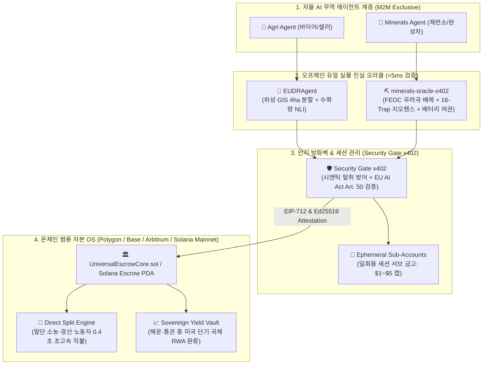

<!-- markdownlint-disable MD033 -->
# 🏛️ A.GRID 연합 3각 편대 시스템 고도화 마스터 사양서 (Unified System Upgrade Spec)

## 📌 개요 (Executive Summary)

본 문서는 `UNIVERSAL_TRUTH_ADAPTER_BLUEPRINT.md` 및 `AGENT_NATIVE_VAULT_BLUEPRINT.md`의 차세대 아키텍처 철학을 바탕으로, **A.GRID 생태계의 3각 편대(Trilogy)**인 **EUDRAgent(농림 원자재)**, **minerals-oracle-x402(EV 배터리 핵심 광물)**, **security-gate-x402(인지 방화벽 & 자본 OS)**를 단일 통합 자율 에이전트 금융·실물 진실 시스템으로 고도화하기 위한 마스터 사양서입니다.

---

## 🌐 3각 편대(Trilogy) 시스템별 역할 정의

| 시스템 | 핵심 산업 영역 | 핵심 진실 검증 요소 (Truth Verifiers) | 결제 및 정산 표준 |
| :--- | :--- | :--- | :--- |
| **🌲 EUDRAgent** | 농림 원자재 (커피, 코코아, 팜유, 고무, 목재, 대두, 우육) | • Sentinel/Planet 위성 4ha 폴리곤 자체 치유 • 산림 벌채 제로(Zero-Deforestation) • 생물학적 수확량 NLI 팩트체크 • TRACES-NT XML 자동 발급 | Native USDC / EURC (소농 협동조합 직불) |
| **⛏️ minerals-oracle-x402** | EV 배터리 핵심 광물 (리튬, 니켈, 코발트, 흑연, 망간 등) | • 미국 IRA FEOC(우려해외집단 25% 지분) 검증 • 16-Trap 위성 분광 지오펜스 원산지 추적 • 디지털 배터리 여권(Battery Passport) & eBL • OECD 분쟁광물 공급망 실사 | Native USDC (채굴사/제련소 직불) |
| **🛡️ security-gate-x402** | 인지 방화벽 & 온체인 자본 운영체제(OS) | • 0.005초 시맨틱 탈취 및 프롬프트 인젝션 차단 • EU AI Act 제50조 자율 AI 에이전트 워터마킹/증명 • `UniversalEscrowCore.sol` 레고 블록 코어 • 일회용 세션 서브 금고($1~$5 캡) 동적 발급 | 가스리스 M2M 결제 & RWA 수율 환류 |

---

## 🏛️ 4대 핵심 고도화 상세 사양

### 1. 듀얼 실물 진실 어댑터 (`ITruthAdapter.sol`) 통합

* **EUDR 진실 어댑터 (`AgriTruthAdapter`)**:
  * 위성 벌채 판정 + 선하증권(BL) + 컨테이너 GPS/온습도 센서 데이터 결합.
  * 생물학적 수확 한도 초과(허위 물량 인플레이션) 적발 시 즉각 차단.
* **광물 진실 어댑터 (`MineralsTruthAdapter`)**:
  * `minerals-oracle-x402`의 16-Trap 지오펜스 원산지 데이터 및 FEOC 검증 결과를 EIP-712 규격으로 패키징.
  * 불법 제련소 세탁 및 제재 국가 우회 화물에 대해 에스크로 자동 슬래싱(Slashing) 실행.
* **초고속 오프체인 합의 (<5ms)**:
  * 마이크로 오라클이 두 산업의 규제 적합성을 5ms 이내 판정 후 단일 표준 증명 해시(`deliverableHash`) 생성.

---

### 2. 차세대 Agent-Native Vault & 일회용 세션 금고 (Ephemeral Sub-Accounts)

* **시맨틱 인지 방화벽 (Semantic Cognitive Firewall)**:
  * 농림 및 광물 무역 에이전트 간의 A2A 협상 중 *"슬리피지 99% 조작"*, *"비인가 지갑으로 대금 편취"*, *"HS 코드 위조"* 등 지능형 프롬프트 공격 원천 방어.
* **작업별 초소액 격리 서브 금고**:
  * 메인 에스크로 금고와 무역 에이전트의 거래 키를 물리적으로 격리.
  * 광물 실사 1건, 위성 분석 1건마다 **$1~$5 한도의 일회용 서브 계정(Ephemeral Sub-Account)**을 동적 발급하여 탈취 리스크 0% 달성.

---

### 3. `UniversalEscrowCore.sol` 단일화 & 말단 공급망 직불 분할 (Direct Split)

* **멀티체인 단일 에스크로 코어**:
  * Polygon, Base, Arbitrum One에 배포된 공통 에스크로 코어(`UniversalEscrowCore.sol`)로 통합.
* **말단 1초 자동 직불 (Instant Direct Split)**:
  * **농림 분야**: TRACES-NT 통관 통과 즉시 제3자 중간상 마진 착취 없이 인도네시아/베트남/가나 현지 소농 협동조합 지갑으로 1초 내 직불 분할.
  * **광물 분야**: 제련소 eBL 확인 및 FEOC 클리어 즉시 채굴 현장 공급사 지갑으로 실시간 정산.

---

### 4. x402 결제 스트리밍 & RWA/국채 수율(Yield) 자동 환류 엔진

* **해운·통관 대기 자본 RWA 수율 환류**:
  * 남미/아프리카에서 EU/북미로의 해상 운송 및 통관 실사 기간(평균 14~45일) 동안 에스크로에 예치된 거액의 USDC/EURC가 유휴 상태로 방치되지 않도록, 토큰화된 미국 단기 국채(USDY/BUIDL RWA)에 자동 예치되어 무위험 이자 생성.
* **HTTP 402 머클 마이크로 스트리밍**:
  * 고해상도 위성 타일 쿼리, 배터리 여권 조회 등 API 호출 시 에이전트 간 머클 스트리밍(ERC-7683) 즉시 결제.

---

## 🗺️ 5단계 통합 구현 로드맵 (Unified Implementation Roadmap)

| 단계 | 고도화 항목 | 대상 레포지토리 및 모듈 | 기대 효과 |
| :--- | :--- | :--- | :--- |
| **Phase 1** | **x402 인지 방화벽 강화 & 시맨틱 가드** | • `security-gate-x402/app` • `eudr-compliance-agent/app/modules/agent_security_gate_adapter.py` • `minerals-oracle-x402/app` | 농림/광물 거래 에이전트 대상 프롬프트 인젝션 및 시맨틱 공격 5ms 차단 |
| **Phase 2** | **듀얼 진실 어댑터 EIP-712 표준화** | • `eudr-compliance-agent/app/modules/web3_escrow_adapter.py` • `minerals-oracle-x402/app/modules/web3_adapter.py` | `ITruthAdapter` 기반 위성 벌채 + 광물 FEOC 단일 온체인 증명 체계 구축 |
| **Phase 3** | **UniversalEscrowCore & 직불 분할(Direct Split)** | • `security-gate-x402/contracts/UniversalEscrowCore.sol` • 3개 프로젝트 전반 | 검증 완료 즉시 말단 소농 및 채굴 현장으로 대금 1초 자동 분할 정산 |
| **Phase 4** | **일회용 세션 서브 금고 (Ephemeral Vault)** | • `security-gate-x402/specs/AGENT_NATIVE_VAULT_BLUEPRINT.md` • 3개 프로젝트 에이전트 매니저 | 에이전트 개인키 탈취 위험 제거 ($1~$5 마이크로 예산 캡 격리) |
| **Phase 5** | **RWA 국채 수율 환류 & x402 스트리밍** | • `security-gate-x402/contracts` • 3개 프로젝트 결제 모듈 | 해운·통관 대기 자본(USDC) 국채 RWA 무위험 수율 자동 환류 |

---

## 📝 관리 및 개정 이력 (Changelog)

* **2026-09-29 (v1.1)**: `minerals-oracle-x402`를 통합 편입하여, **농림(EUDR) + 핵심광물(Minerals) + 인지방화벽/자본OS(Security Gate)** 3각 편대 통합 사양서로 전면 개정.
* **2026-09-29 (v1.0)**: 시스템 고도화 사양서 초안 등록.
